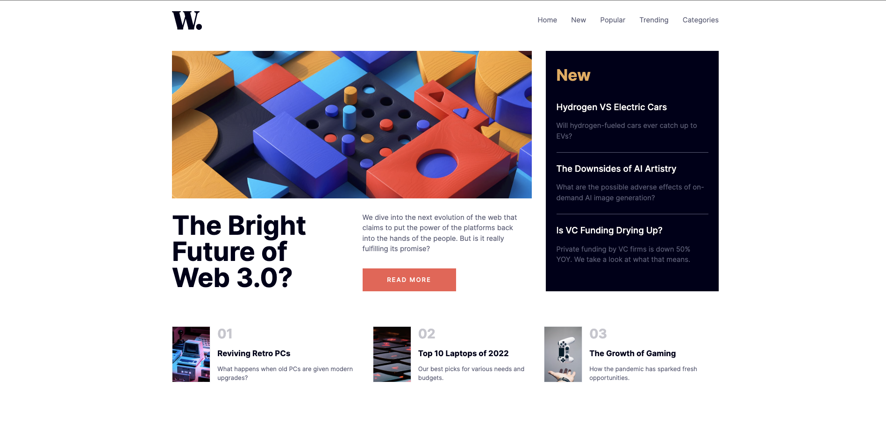

# Frontend Mentor Challenges

A list of frontend mentor UI design implementation challenges.

Each project showcases a variety of skills and technologies used in modern software development

Below are a list of these projects with likes to the live sites, code repositories, and original challenge descriptions.

## Project List

<table>
	<tr>
		<td align="center" width="50%">
			<h2>Product-Review Card</h2>
			

				
			

			

    		<a href="https://product-review-card-mu.vercel.app/" target="_blank">Live</a> | 
				<a href="https://github.com/victorbruce/product-review-card" target="_blank">Repo</a>
  

		</td>
		<td width="50%">
			<picture>
				
			</picture>
		</td>
	</tr>
</table>

<table>
	<tr>
		<td align="center" width="50%">
			<h2>QR Code Component</h2>
			

				
			

			

    		<a href="https://qr-code-component-six-eta.vercel.app/" target="_blank">Live</a> | 
				<a href="https://github.com/victorbruce/qr-code-component" target="_blank">Repo</a>
  

		</td>
		<td width="50%">
			<picture>
				
			</picture>
		</td>
	</tr>
</table>

<table>
	<tr>
		<td align="center" width="50%">
			<h2>News Home Page</h2>
			

				
			

			

    		<a href="https://news-homepage-victorbruce.vercel.app/" target="_blank">Live</a> | 
				<a href="https://github.com/victorbruce/news-homepage" target="_blank">Repo</a>
  

		</td>
		<td width="50%">
			<picture>
				
			</picture>
		</td>
	</tr>
</table>