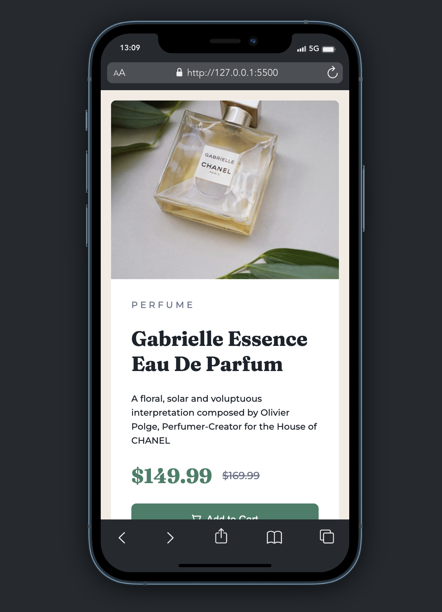

# Frontend Mentor - Product preview card component solution

This is a solution to the [Product preview card component challenge on Frontend Mentor](https://www.frontendmentor.io/challenges/product-preview-card-component-GO7UmttRfa). Frontend Mentor challenges help you improve your coding skills by building realistic projects. 

 ## Table of contents

- [Overview](#overview)
  - [The challenge](#the-challenge)
  - [Screenshot](#screenshot)
  - [Links](#links)
- [My process](#my-process)
  - [Built with](#built-with)
  - [What I learned](#what-i-learned)
  - [Continued development](#continued-development)
- [Author](#author)


## Overview

### The challenge

Users should be able to:

- View the optimal layout depending on their device's screen size
- See hover and focus states for interactive elements

### Screenshot




### Links

- Solution URL: [GitHub Link](https://github.com/victorbruce/frontend-mentor-challenges/tree/main/product-review-card)
- Live Site URL: [product-review-card](https://frontend-mentor-challenges-theta-ruby.vercel.app/)

## My process

### Built with

- Semantic HTML5 markup
- CSS custom properties
- Flexbox

### What I learned

Using the srcset and sizes attribute on an image tag.

```html

```

### Continued development

I will like to look into how to handle images of different sizes for different screens using the srcset and sizes attributes instead of using css to change images based on the screen size. I had some few challenges using this attribute in this project.

## Author

- Website - [victorbruce.dev](https://victorbruce.dev)
- Frontend Mentor - [@victorbruce](https://www.frontendmentor.io/profile/victorbruce)
- Twitter - [@Victorbruce3](https://twitter.com/Victorbruce3)


